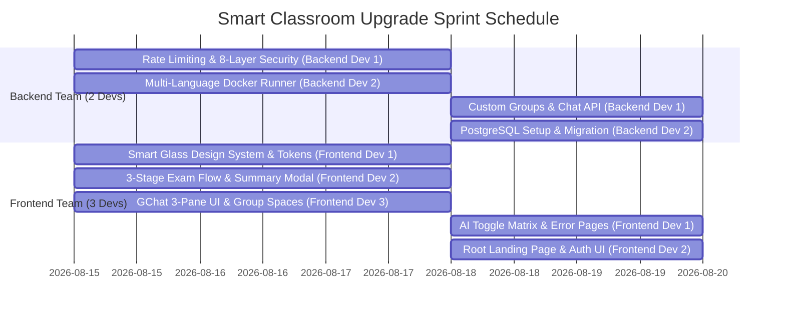
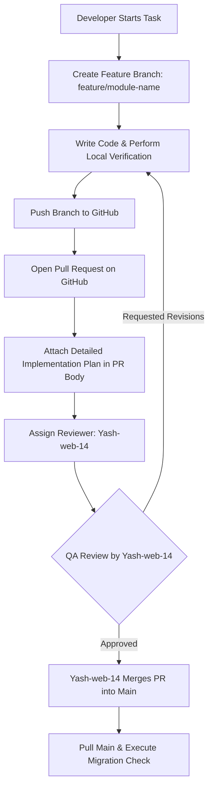

# Smart Classroom Platform — Comprehensive Master Plan (v3.0)

**Project Role**: Client / Project Manager (PM) / Quality Assurance (QA) & Lead  
**Lead Reviewer**: `Yash-web-14`  
**Team Structure**: 5 Developers (2 Backend Engineers + 3 Frontend Engineers)  
**Target Release**: v3.0 (PostgreSQL Ready & Architecture Overhaul)

---

## 👥 1. Team Allocation & Work Breakdown Structure

### Team Responsibilities:

| Role | Member | Primary Module Deliverables |
| :--- | :--- | :--- |
| **Project Lead & PM/QA** | **Yash-web-14** | • Overall project governance, PR review, QA test execution, and PostgreSQL release sign-off. |
| **Backend Dev 1** | **Backend Lead** | • **Module 1**: HTTP-Level Rate Limiting (`django-ratelimit`) on Login, AI, & Code APIs. • **Module 4**: 8-Layer Enterprise Security Suite Audit. • **Module 10.a**: `CustomGroup` & `CustomGroupMessage` Models & APIs for Custom Chat Spaces. • **Module 11.a**: SMTP Email settings & Password Reset backend logic. |
| **Backend Dev 2** | **DevOps & Execution Lead** | • **Module 2**: Multi-Language Render `Dockerfile` (`gcc`, `g++`, `default-jdk`, `python3`). • **Module 2.b**: Upgrade `tests/services.py` subprocess runner for C, C++, Java, and Python under 5s hard limits. • **Module 5**: PostgreSQL dual-backend setup via `dj-database-url`. |
| **Frontend Dev 1** | **UI/UX Design Lead** | • **Module 8**: Standardize Smart Glass Design System tokens in `base.html` (`#0f172a` bg, `16px` radius, `1.5rem` padding). • **Module 8.b**: Purge card-inside-card nesting using `.glass-strip` and enforce `h-100 flex-fill` equalized grid heights. • **Module 7**: Admin AI Permission Toggle Matrix UI (`templates/users/ai_permissions_matrix.html`). |
| **Frontend Dev 2** | **Exam & Landing Page Lead** | • **Module 6**: 3-Stage Exam Flow (Pre-Exam Instructions View with checkbox $\rightarrow$ Clean Exam Wizard $\rightarrow$ Post-Exam Submission Modal showing skipped question warning badges). • **Module 9**: Root Landing Page (`/`) with space hero backdrop, feature cards, and dynamic CTA buttons. • **Module 3**: Custom Glassmorphic Error Pages (403, 404, 500). |
| **Frontend Dev 3** | **Interactive Chat Lead** | • **Module 10.b**: 3-Pane Google Chat (GChat) inspired UI layout in `templates/chat/inbox.html`. • **Module 10.c**: "+ New Group Space" modal with interactive member picker. • **Module 11.b**: Glassmorphic Password Reset UI templates (`password_reset.html`, `confirm.html`, `complete.html`). |

---

## 🛠️ 2. Comprehensive Module Requirements & Change Specs

### Module 1: Rate Limiting & Protection (`django-ratelimit`)
- **Login & Registration**: Rate limit to 5 attempts/minute per IP address (`key='ip'`, `rate='5/m'`).
- **AI Tutor & RAG Queries**: Rate limit to 15 requests/hour per authenticated learner (`key='user'`, `rate='15/h'`).
- **Code Execution API**: Rate limit to 20 execution requests/minute per learner (`key='user'`, `rate='20/m'`).
- **Error Response**: Render custom glassmorphic HTTP 429 "Too Many Requests" page.

### Module 2: Multi-Language Docker Runner (C, C++, Java, Python)
- **Render Dockerfile**: Base image `python:3.11-slim` pre-installing `gcc`, `g++`, `default-jdk`, and `python3`.
- **Question Schema**: Add `language` field to `Question` model (`python`, `c`, `cpp`, `java`).
- **Subprocess Runner**: Upgrade `tests/services.py` to compile and execute solutions:
  - **C**: `gcc solution.c -o solution && ./solution`
  - **C++**: `g++ solution.cpp -o solution && ./solution`
  - **Java**: `javac Solution.java && java Solution`
  - **Python**: Isolated subprocess runner.
  - Enforce 5.0-second hard execution timeout per test case.

### Module 3: Custom Error Pages (403, 404, 500)
- **403 Forbidden** (`templates/403.html`): Glassmorphic Access Denied page with "Return to Dashboard" CTA.
- **404 Not Found** (`templates/404.html`): Glassmorphic Page Not Found page.
- **500 Server Error** (`templates/500.html`): Friendly server exception error page.

### Module 4: 8-Layer Enterprise Security Suite
1. `AccountStatusMiddleware` (Lock out pending users from accessing endpoints except logout/approval-status)
2. Role-Based Access Control (`@login_required`, `is_admin`, `is_teacher`, `is_student`)
3. CSRF Protection (``)
4. PBKDF2 Password Hashing with salt
5. Strict File Extension & MIME Type Validation (`.zip` for projects, image headers for avatars)
6. XSS & Clickjacking Protection (`XFrameOptionsMiddleware`)
7. Execution Subprocess Timeout Isolation (5.0s hard limit)
8. HTTP-Level Rate Limiting (`django-ratelimit`)

### Module 5: PostgreSQL Database Switch Strategy (Supabase vs Neon)
- **Dual-Backend Configuration**: Read `DATABASE_URL` via `dj_database_url` in `smart_classroom/settings.py`.
- **Recommendation**: **Supabase** (500 MB Postgres DB + 1 GB Free File Storage for student avatars & PDFs).
- **ORM Proof**: Zero HTML template, view, or form changes required when switching backends!

### Module 6: 3-Stage Exam Flow Refactoring
- **Stage 1 (Pre-Exam Instructions View)**: `/tests/<id>/instructions/` showing duration, total marks, rules, and an agreement checkbox `[ ] I agree`. The "Start Exam" button remains disabled until checked.
- **Stage 2 (Clean Exam Wizard)**: `/tests/<id>/take/` focused question navigation without header clutter.
- **Stage 3 (Post-Exam Review Modal)**: Interactive popup modal triggering on "Submit Exam":
  - Displays Attempted Questions ($X / \text{Total}$).
  - Displays Unattempted Questions ($Y / \text{Total}$) with a warning badge if $Y > 0$.
  - Provides "Review Questions" and "Confirm Final Submission" action buttons.

### Module 7: AI Access Restrictions & Admin Feature Toggle Matrix
- **CustomUser Flags**: `can_use_ai_tutor`, `can_use_rag_docs`, `can_use_ai_viva`, `can_use_ai_generator`.
- **Pending Lock**: Unapproved accounts (`account_status='pending'`) locked out of AI endpoints.
- **Admin UI Toggle Matrix**: Workspace owners can toggle specific AI tools ON/OFF per user or group.

### Module 8: Smart Glass Design System & Component Architecture
- **3-Layer Architecture**: Background Canvas (`#0f172a`) $\rightarrow$ Transparent Layout Grid $\rightarrow$ Surface Cards (`rgba(30, 41, 59, 0.88)`).
- **Purge Nested Cards**: Replace card-inside-card elements with Flat Glass Strips (`.glass-strip`).
- **Equalized Height Grids**: Enforce `h-100 flex-fill` on grid cards with `mt-auto` action footers.
- **Standardized Tokens**: `16px` border-radius (`var(--sc-radius-card)`), `1.5rem` padding scale, `999px` pill shapes for buttons/badges.

### Module 9: Root Landing Page (`/`)
- **Hero Banner**: Space backdrop title *"Smart Learner: AI-Augmented Education Ecosystem"*.
- **Feature Showcase Cards**: Previews for RAG Document QA, 3D Flashcards, AI Viva, Instructor Analytics.
- **Dynamic CTAs**: *"Get Started"* & *"Sign In"* for guests; *"Go to Dashboard"* for authenticated users.

### Module 10: Google Chat (GChat) Style UI & Self-Making Custom Groups
- **3-Pane Layout**: Left Navigation Drawer $\rightarrow$ Center Message Workspace $\rightarrow$ Right Context Panel (Group Details & Shared Files).
- **Self-Making Custom Groups**: `CustomGroup` and `CustomGroupMessage` models allowing students and teachers to create custom study groups independent of courses.
- **Rich Messaging**: Avatar role pills (`Admin`, `Teacher`, `Student`), timestamp headers, file attachment previews, and emoji reactions.

### Module 11: Secure SMTP Email Infrastructure & Password Reset Workflow
- **Security Verification**: Cryptographically signed HMAC-SHA256 tokens (`PasswordResetTokenGenerator`), TLS/SSL transport (port 587), environment secret protection.
- **6-Step Workflow**: "Forgot Password?" link on login page $\rightarrow$ Email submission $\rightarrow$ Secure token link $\rightarrow$ Password reset confirm $\rightarrow$ Completion redirect to login.

---

## 📌 3. Mandatory Developer Git Protocol & PR Guidelines

### Git Rules:
1. **No Direct Commits to Main**: All work must be developed on a dedicated feature branch.
2. **Branch Naming**:
   - `feature/backend-security-ratelimit`
   - `feature/docker-multilang-runner`
   - `feature/exam-flow-design-system`
   - `feature/ai-toggles-gchat-landing`
3. **Mandatory Implementation Plan**: Every PR must contain a copy of the developer's detailed Implementation Plan in the description body.
4. **Mandatory Reviewer Assignment**: Every PR MUST assign **`Yash-web-14`** as the Reviewer. Developers are strictly forbidden from self-merging PRs.

---

## 🧪 4. QA Testing Protocol & Verification Checklists

As **Project Manager & QA Lead**, `Yash-web-14` will verify all deliverables against 20 specific QA test cases before signing off on production deployment:

- [ ] **Rate Limiting**: Confirm HTTP 429 after 5 failed login attempts or 15 AI queries.
- [ ] **Multi-Language Runner**: Execute C, C++, Java, and Python test cases and verify timeout enforcement at 5.0 seconds.
- [ ] **Exam Workflow**: Verify rules checkbox disables/enables "Start Exam" and test skipped question warning badges in submission modal.
- [ ] **AI Access Matrix**: Verify pending accounts and users with `can_use_ai_* = False` are blocked from AI endpoints.
- [ ] **GChat Custom Spaces**: Create a custom group space, invite peers, and verify real-time message delivery & file sharing.
- [ ] **Password Reset**: Request password reset email, click HMAC token link, and verify password update.
- [ ] **Design System Compliance**: Verify dark mode aesthetics, `16px` card radiuses, `h-100 flex-fill` card height equalization, and absence of nested cards.
- [ ] **PostgreSQL Migration**: Perform SQLite data dump (`python manage.py dumpdata`), connect PostgreSQL, execute `python manage.py migrate`, and restore data with `loaddata`.

---
*Master Plan Document — Smart Classroom Ecosystem.*
